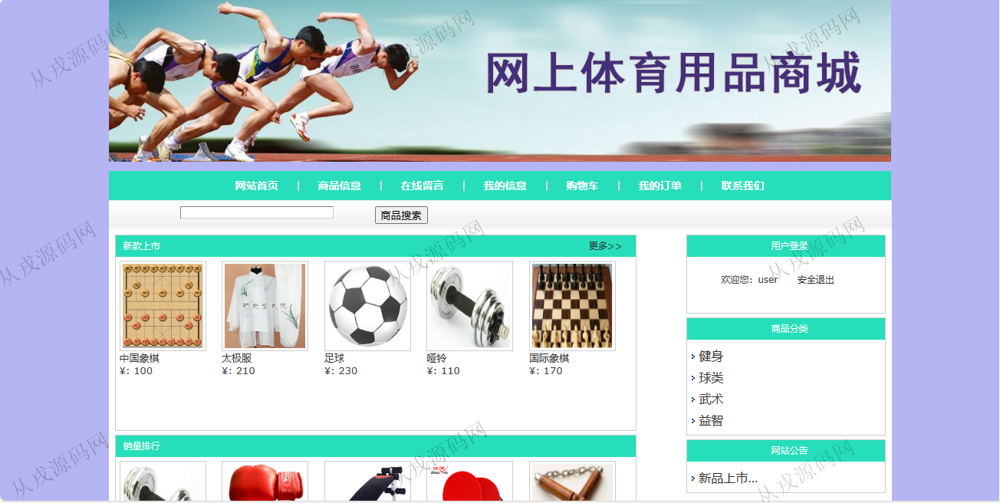
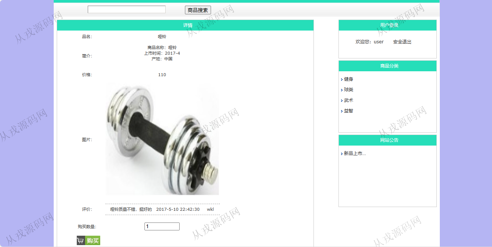
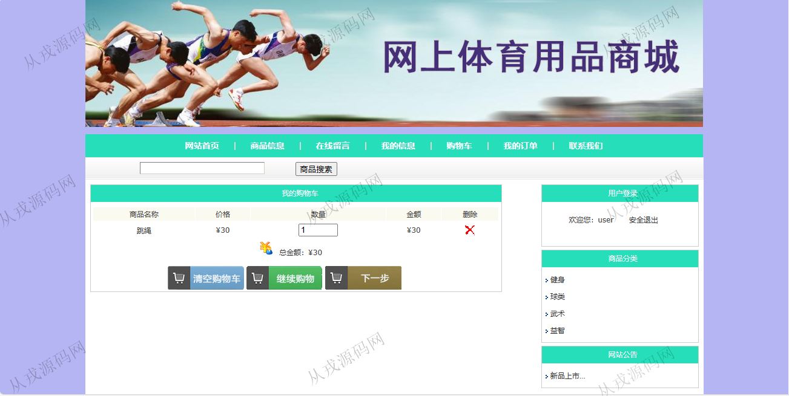
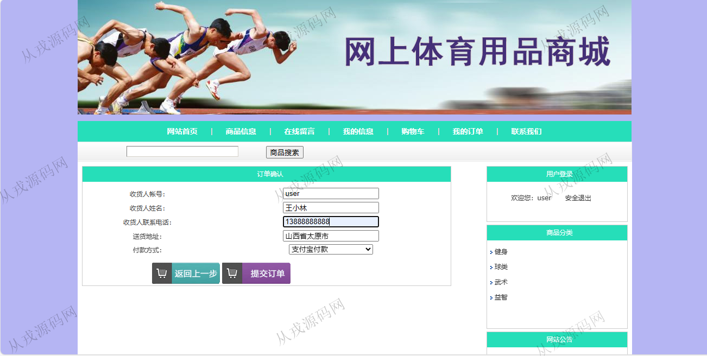
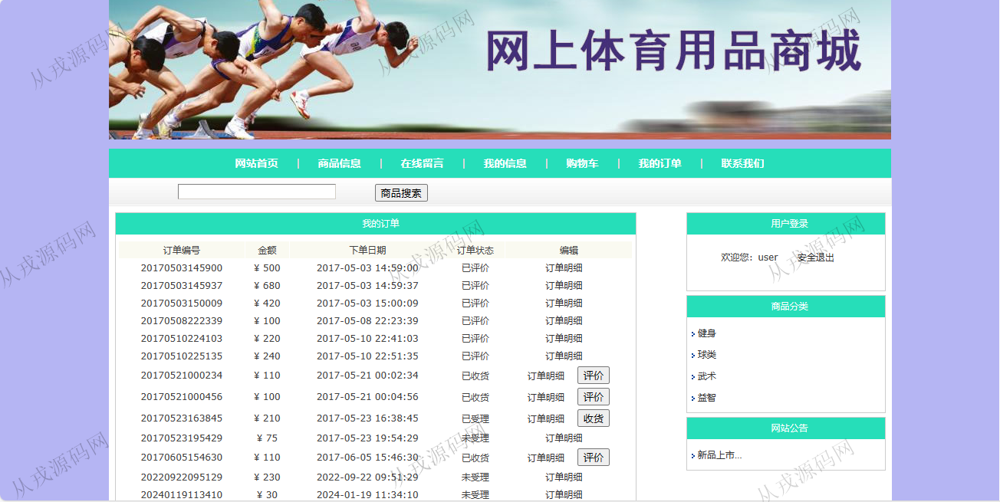
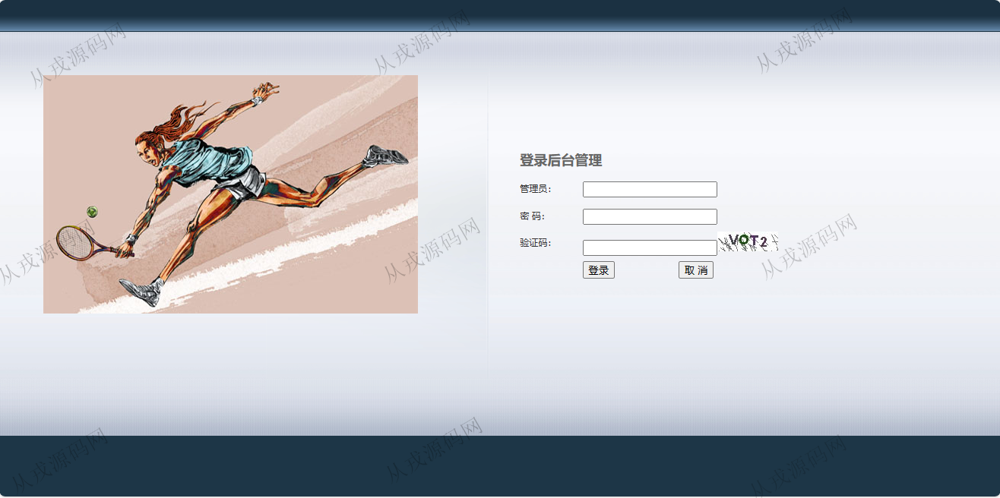
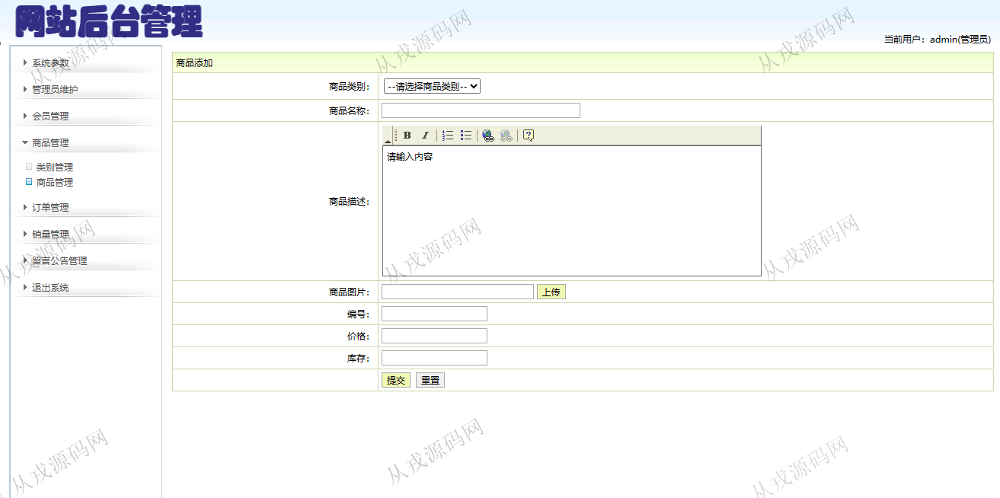
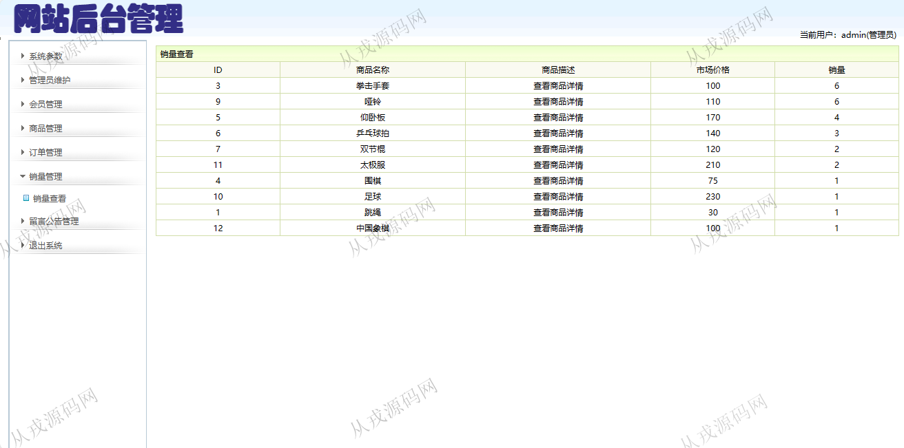

<h1 align="center">178.网上体育用品商城管理系统</h1>

 获取sql文件 QQ: 386869957 QQ群: 377586148 

 [更多源码项目: 从戎源码网](https://armycodes.com/) 

## 简介

> 本代码来源于网络,仅供学习参考使用!
>
> 提供1.远程部署/2.修改代码/3.设计文档指导/4.框架代码讲解等服务

> 用户端访问地址：http://localhost:8080/tyypsc/index.action
>
> 用户：user 123456
>
> 管理后台：http://localhost:8080/tyypsc/admin/login.jsp
>
> 管理员：admin 123456
>

## 项目介绍
基于ssh的网上体育用品商城管理系统：前端 jsp、jquery，后端 struts、spring、hibernate；角色分为管理员，用户；集成商品信息、购物车、我的订单等功能于一体的系统。

## 功能介绍

### 用户

- 基本功能：登录、安全退出、联系我们
- 商品购买：商品列表展示，商品搜索，商品分类导航，商品详情，购物车，在线结算
- 我的订单：订单列表查询
- 网站公告：公告信息列表展示，公告详情

### 管理员

- 会员管理：会员信息列表查询，会员删除
- 商品管理：商品信息的增删改查，商品图片上传，商品描述支持富文本编辑
- 商品类别管理：类别信息的增删改查
- 订单管理：订单列表查询，订单受理，订单删除
- 销量管理：销量信息的列表查询
- 留言公告管理：留言信息查看，删除，添加公告，删除公告

## 环境

- <b>IntelliJ IDEA 2021.3</b>

- <b>Mysql 5.7.26</b>

- <b>Tomcat 7.0.73</b>

- <b>JDK 1.8</b>

## 运行截图

